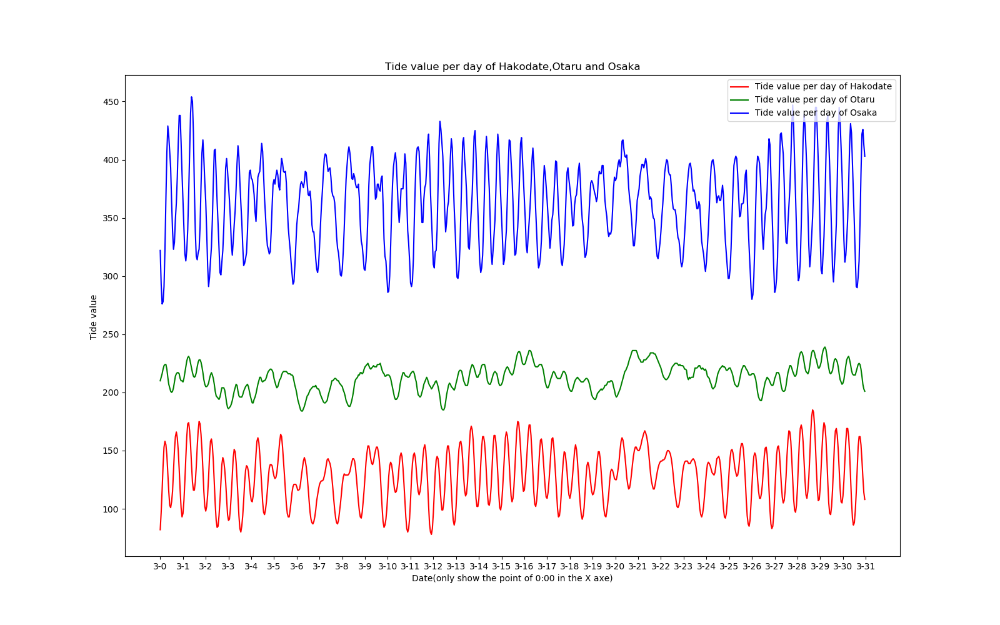

# Japan-Tide-analysis-forcast
### This is the report repo of Tokyo Institude of Technology of Advance Signal Processing Provided by Pro.Seiichiro Hara, 2021.   

#### In this report, I selected Hakodate, Otaru, and Osaka tide data in March 2021 from the historical tide data provided by the Japan Meteorological Administration[1] as the research objects for analysis. Among them, Hakodate and Otaru belong to the Hokkaido region, and their data can reflect to a certain extent the tidal activity patterns in the waters around Hokkaido in March. Osaka belongs to the Kansai region and is a certain distance away from Hokkaido. The reason for choosing Osaka is to explore the similarities and differences between Osaka and Hokkaido to extract the tidal motion laws.   
        
### In this report, the following data and signal processing methods are used:    
* Autocorrelation analysis
* Partial autocorrelation analysis
* Sliding smoothing
* Smoothness detection
* White noise detection
* ARIMA time series model construction and forecast
* Amplitude spectrum calculation
* Energy spectrum calculation
* Cross-correlation calculation
*  R value calculation   
   All data processing is performed by python's third-party libraries: `numpy`, `statsmodel`, `matlibpyplot` for calculation and image drawing.   

   The Orginal data of Tide Value of Hakotade, Otaru, and Osaka in March 2021.    

 
